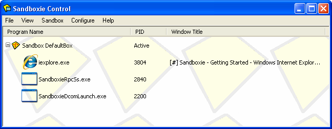

# Getting Started Part Two

### 第二部分: 运行网络浏览器

若要启动 Web 浏览器，请找到沙盒 Web 浏览器的桌面快捷方式图标（标题一般为“浏览器（沙盒）”，图中为英文版），然后单击它：

或者，鼠标右键单击 [Sandboxie Control](SandboxieControl.md) 托盘图标, 在弹出的 [托盘图标界面](TrayIconMenu.md) 中选择 _启动网络浏览器_ 菜单.

第三种方式是通过在 [Sandboxie Control](SandboxieControl.md) 中的 [沙盒菜单](SandboxMenu.md) 启动：

* * *

Your Web browser should come up _sandboxed_. You can tell that a program is sandboxed because its window title bar contains additional Sandboxie **[#]** indicators: ((NOTE: Newer browsers may not show the # in the title bar, however if you hover your mouse along the edges of the window, it will turn yellow.)

(Note: In some computer systems, Sandboxie starts the wrong program when you select _Run Web Browser_. If this is the case for you, see [Frequently Asked Questions](FrequentlyAskedQuestions.md#why-does-the-wrong-program-start-when-i-run-my-default-web-browser-sandboxed) to fix this.)

The sandboxed program should appear in the main window of [Sandboxie Control](SandboxieControl.md):

The window displays the list of programs that are currently running _sandboxed_ under the supervision of Sandboxie. Initially there is just one sandbox, _DefaultBox_, however, more sandboxes can be created; see the [Create New Sandbox](SandboxMenu.md#create-new-sandbox) command in the [Sandbox Menu](SandboxMenu.md).

The picture above shows Sandboxie is running three programs. The first, _iexplore.exe_, stands for Internet Explorer, as this tutorial assumes Internet Explorer is the Web browser in use. If the default Web browser in your system is Firefox, or Opera, then you would see _firefox.exe_ or _opera.exe_, respectively, as the first program running in the sandbox.

The screenshot shows two more programs are running, **SandboxieRpcss.exe** and **SandboxieDcomLaunch.exe**. These support programs are part of Sandboxie. If they are needed, they will be automatically started, without any explicit action on your part. See [Service Programs](ServicePrograms.md).

When Sandboxie is actively running programs in any of the sandboxes, the Sandboxie tray icon (at the corner of the screen) displays red dots: 

* * *

The tutorial continues in [Getting Started Part Three](GettingStartedPartThree.md).
