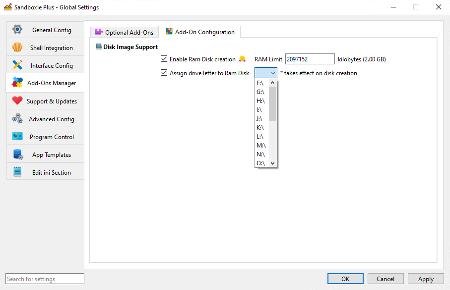

# Ram Disk Size Kb

_RamDiskSizeKb_ is a global setting in [Sandboxie Ini](SandboxieIni.md) (introduced in v1.11.0 / 5.66.0) that specifies the size of the RAM disk to be created for use by sandboxes that have the [UseRamDisk](UseRamDisk.md) setting enabled. This setting is defined in kilobytes and determines the maximum amount of system RAM that can be allocated for the RAM disk.

## Usage

To set the `RamDiskSizeKb`, add the following line to the Sandboxie configuration file under the `[GlobalSettings]` section:

```ini
[GlobalSettings]

# Example for a 2 GB RAM disk
RamDiskSizeKb=2097152
```

## SandMan GUI

The RAM disk size setting can be set through:

1. Open the `Global Settings` window in the SandMan interface.
2. Navigate to `Add-Ons Manager` > `Add-On Configuration` tab.
3. Enable the `Enable Ram Disk creation` setting and set a value for the RAM disk size.

	

## Important Notes

- **Single RAM Disk**: Only one RAM disk will be created and used among all sandboxes that have the `UseRamDisk` setting enabled. This means that the specified size will be shared across all sandboxes utilizing RAM disks.
  
- **Memory Management**: Ensure that the specified size does not exceed the available system memory. Allocating too much memory for the RAM disk can lead to system instability or prevent other applications from functioning properly. If the specified size exceeds available RAM, the RAM disk may fail to mount, and an error will be logged.

- **Volatile Storage**: The RAM disk is volatile, meaning all data stored in it will be lost when the RAM disk is unmounted or the system is restarted. It is ideal for temporary operations where data persistence is not required.

- **Configuration Requirement**: Before enabling `UseRamDisk` in individual sandboxes, ensure that the `RamDiskSizeKb` setting is configured appropriately in the global settings.

- **Drive Letter Assignment**: The drive letter for the RAM disk can be assigned using the `RamDiskLetter` setting.

## Performance Considerations

- **Speed**: RAM disks provide significantly faster read and write speeds compared to traditional disk storage, making them suitable for high-performance applications and testing environments.

- **Resource Monitoring**: Monitor system memory usage when using RAM disks to avoid exceeding available memory and causing system performance issues. 

- **Application Suitability**: Consider using RAM disks for applications that require high-speed data access, such as development environments, testing frameworks, or temporary file storage.

## Related Settings

- [UseRamDisk](UseRamDisk.md) - Enables the use of a RAM disk for individual sandboxes.
- [RamDiskLetter](RamDiskLetter.md) - Specifies the drive letter for the RAM disk.

By configuring the `RamDiskSizeKb` setting, users can optimize their Sandboxie environment for performance while ensuring efficient memory usage across all sandboxes that utilize RAM disks.