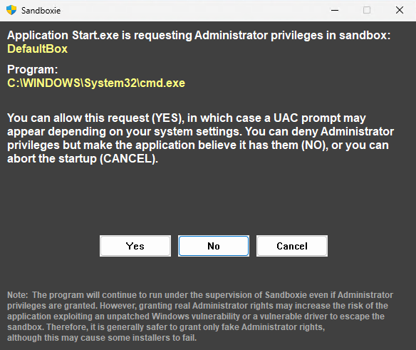

# 使用沙盒 UAC

**UseSandboxieUAC** 是一个全局沙盒设置，在 [Sandboxie Ini](SandboxieIni.md) 中可用，自 v1.16.0/5.71.0 版本起提供。启用后，Sandboxie 会拦截并管理来自沙盒应用程序的 UAC 提升请求。

用法：

```ini
   [GlobalSettings]
   UseSandboxieUAC=y
```

## 沙盒 UAC 提示



| 字段/按钮 | 描述                                                                                   |
| --------- | -------------------------------------------------------------------------------------- |
| **沙盒**  | 请求来源的沙盒名称（例如："DefaultBox"）。                                             |
| **程序**  | 请求权限的可执行文件（例如："C:\WINDOWS\System32\cmd.exe"）。                          |
| **提示**  | 解释授予真实管理员权限的风险，并建议使用虚假权限以确保安全，但某些安装程序可能会失败。 |
| **是**    | 授予真实管理员权限（可能触发 UAC 提示）。                                              |
| **否**    | 授予虚假[^1]管理员权限（应用程序认为它具有这些权限）。                                 |
| **取消**  | 拒绝请求并中止程序启动。                                                               |

## 行为和配置

默认情况下，Sandboxie 遵循系统的 UAC 配置 - 当用户账户控制设置为在安全桌面上提示时，Sandboxie 的 UAC 提示也会显示在那里。可以使用 [安全桌面上的提示](PromptOnSecureDesktop.md) 设置来修改此行为，以防止沙盒应用程序在安全桌面上显示提升提示。

## 相关配置

此设置对应于 **Sandboxie Plus** 中以下路径的 GUI 选项：

**选项** > **全局设置** > **高级配置**：_使用 Sandboxie 自己的增强 UAC 提示（实验性）_。

[^1]: 有关更多信息，请参阅 [模拟管理员权限](FakeAdminRights.md)。
